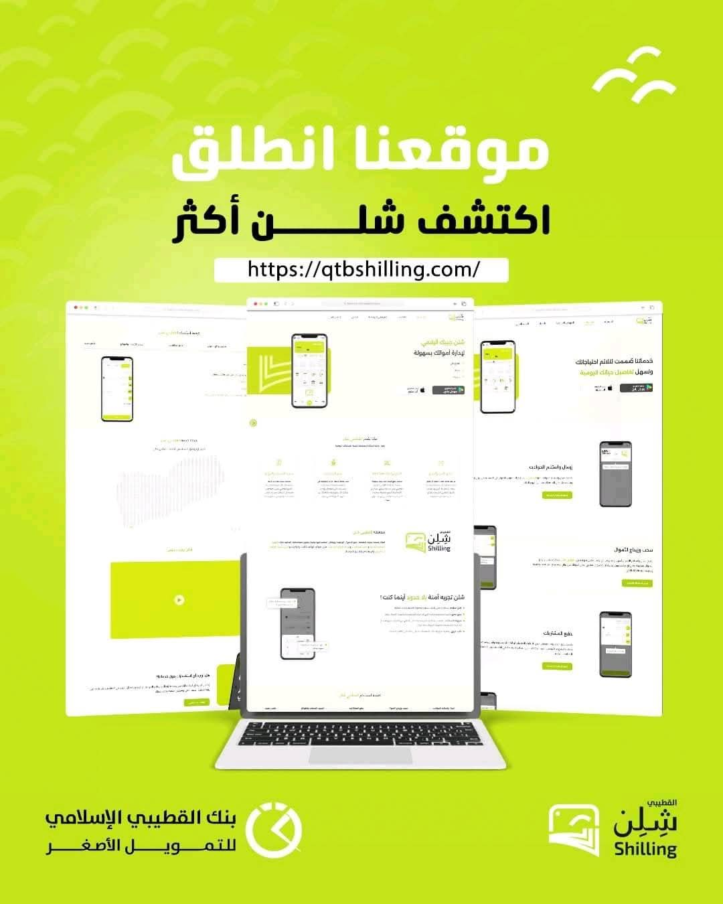

# Al-Qutaibi Wallet

FinTech marketing platform developed as a production-ready full-stack project for a client through Becon Agency.

## Overview
Al-Qutaibi Wallet is a digital wallet marketing platform designed to present product information clearly while giving the client direct control over content updates. The platform combines a dynamic frontend with a manageable backend workflow for ongoing business use.

## My Role
- Full-Stack Developer
- Worked through: Becon Agency
- Responsibility: Frontend, backend integration, dashboard workflow, database-connected content handling, and deployment support

## Tech Stack
- React
- SCSS
- ASP.NET
- MySQL

## Key Features
- Dynamic marketing website
- Dashboard for managing texts, images, and pages
- Editable content workflow for non-technical users
- Full-stack architecture connected to a database
- Production-ready implementation

## Live Project
- Website: https://qtbshilling.com/

## Project Status
- Source code is not publicly available
- This repository is published as a project showcase and portfolio reference

## Notes
This project was delivered for a client through an agency, so the source code is kept private.
